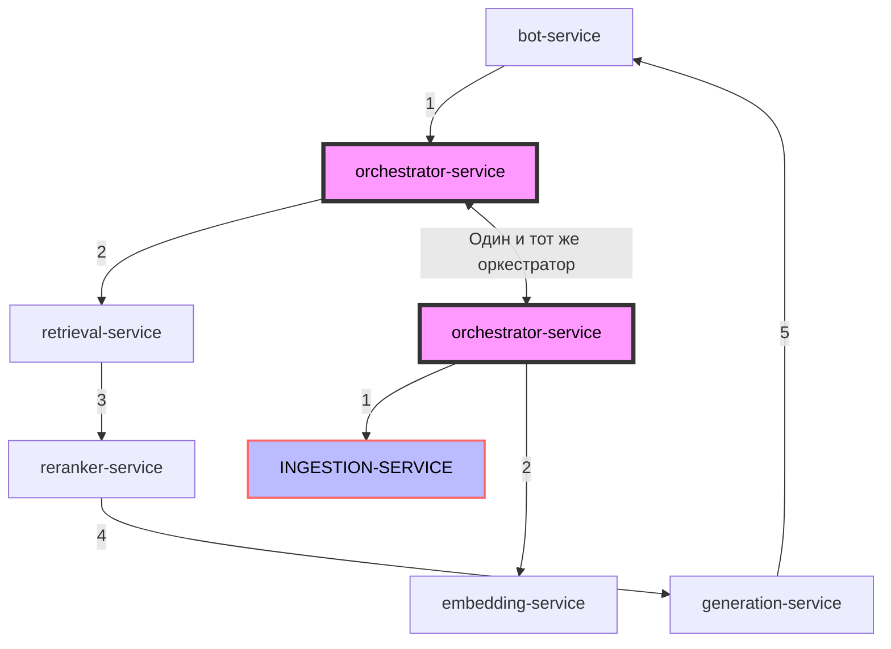

# INGESTION-SERVICE 
- Сервис для работы с документами, их загрузка и хранение в S3, а также сохранение metadata документов

    

orchestrator-service

bot-service 

retrieval-service 
reranker-service

evaluator-service

generation-service

ingestion-service 
embedding-service

